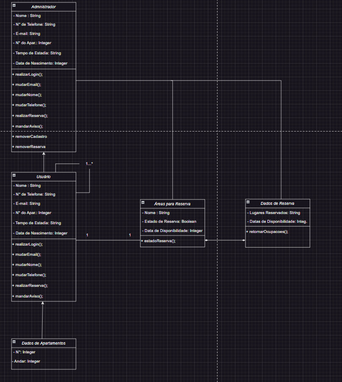

# Arquitetura da Solução

Pré-requisitos: <a href="3-Projeto de Interface.md"> Projeto de Interface</a>

Definição de como o software é estruturado em termos dos componentes que fazem parte da solução e do ambiente de hospedagem da aplicação.

## Diagrama de Classes

## Modelo ER (Projeto Conceitual)

## Projeto da Base de Dados

## 1. Requisitos do Sistema

O sistema de gerenciamento de condomínios deve ser capaz de lidar com várias funcionalidades essenciais, incluindo:

Controle de Acesso: Registrar informações sobre visitantes, incluindo nome, data de visita, tempo de permanência, morador visitado e outros detalhes relevantes. Além disso, deve permitir o bloqueio ou liberação de acesso conforme necessário.

Perfil de Condôminios: Manter perfis completos dos moradores, incluindo informações como nome, foto, dados de contato e registro de avisos.

Reserva de Áreas Lazer: Permitir que os moradores agendem áreas comuns, como churrasqueira, piscina e salão de festas, e forneçam informações sobre a disponibilidade dessas áreas.

Chamados de Manutenção: Oferecer a capacidade de registrar chamados de manutenção, incluindo detalhes do problema, nível de urgência e inclusão de fotos.

## 2. Modelagem do Banco de Dados

Com base nos requisitos acima, podemos criar as seguintes tabelas:

## Tabela: Condôminos

- ID (Chave Primária);
- Nome;
- Foto (Link para a foto do morador);
- Telefone;
- Email.

## Tabela: Síndico

- ID (Chave Primária);
- Nome;
- Foto (Link para a foto do síndico);
- Telefone;
- Email.
 
 
## Tabela: Visitantes

- ID (Chave Primária);
- Nome;
- Data de Visita;
- Tempo de Permanência;
- Morador Visitado (Chave Estrangeira referenciando a tabela de Moradores);
- Detalhes Adicionais.

## Tabela: Registros de Acesso

- ID (Chave Primária);
- Visitante (Chave Estrangeira referenciando a tabela de Visitantes);
- Data e Hora de Entrada;
- Data e Hora de Saída;
- Status de Acesso (Bloqueado ou Liberado).

## Tabela: Áreas de Lazer

- ID (Chave Primária);
- Nome da Área (por exemplo, Churrasqueira, Piscina, Salão de Festas);
- Disponibilidade (Indicando se a área está disponível para agendamento).

## Tabela: Chamados de Manutenção

- ID (Chave Primária);
- Morador (Chave Estrangeira referenciando a tabela de Moradores);
- Data de Abertura;
- Nível de Urgência;
- Descrição do Problema;
- Fotos (Links para fotos do problema).

## 3. Interface de Aplicação

O sistema será acessado por meio de uma interface de aplicação web, que permitirá aos moradores, síndico, visitantes e administradores interagir com as funcionalidades do sistema de forma intuitiva e responsiva.

## Tecnologias Utilizadas

Descreva aqui qual(is) tecnologias você vai usar para resolver o seu problema, ou seja, implementar a sua solução. Liste todas as tecnologias envolvidas, linguagens a serem utilizadas, serviços web, frameworks, bibliotecas, IDEs de desenvolvimento, e ferramentas.

Apresente também uma figura explicando como as tecnologias estão relacionadas ou como uma interação do usuário com o sistema vai ser conduzida, por onde ela passa até retornar uma resposta ao usuário.

## Hospedagem

Explique como a hospedagem e o lançamento da plataforma foi feita.

